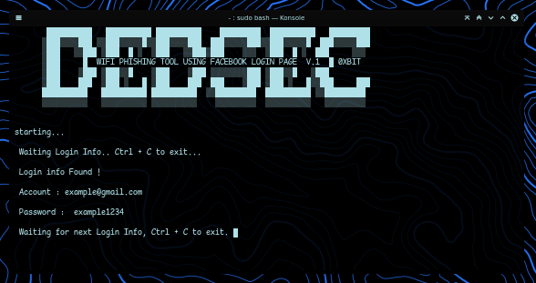

# DEDSEC WIFIPHISH 
It can create fake access point, and create captive portal to redirect users to fake login page.

### banner

### INSTALLATION
* git clone https://github.com/0xbitx/dedsec-wifiphish.git
* cd dedsec-wifiphish
* sudo bash dedsec-wifi-phishing.sh

### TESTED ON FOLLOWING:
* Kali Linux
* Parrot OS
* Ubuntu
* Arch Linux

### PREREQUISITES
* sudo - [ MUST ]
* wifi adapter support AP mode

### LANGUAGE 
* Bash Script

# disclaimer:
  I'm not responsible for anything you do with this program, so please only use it for good and educational purposes.
